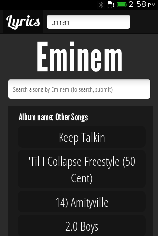
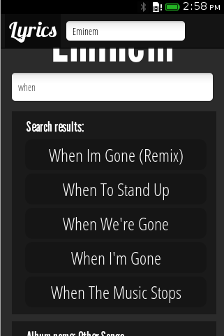
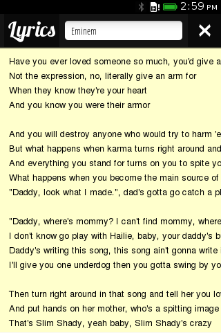

FirefoxOS-lyrics-application
============================

FirefoxOS lyrics application.

The application is in the Firefox Marketplace at https://marketplace.firefox.com/app/lyrics.

Development
-----------

The application is written in HTML5, JavaScript and jQuery. Lyrics are avalible only trough iframes, because there
isn't an public API that can offer lyrics.

Screenshots
-----------

	
	
	
	
	

